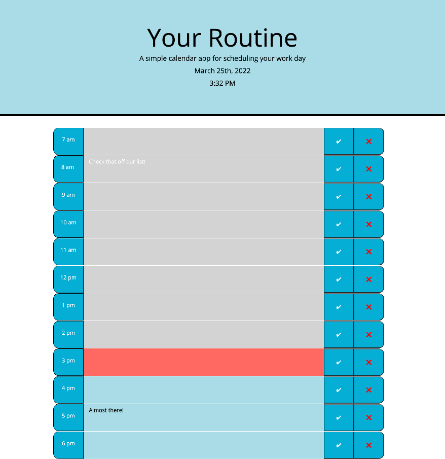
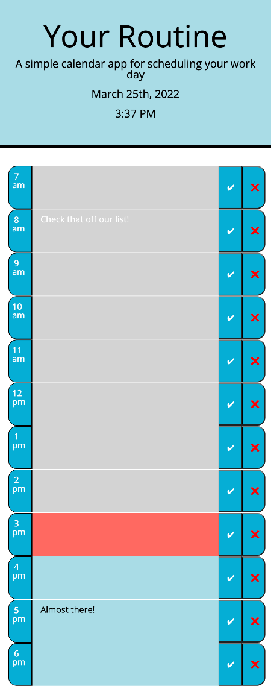

# Your Routine, An Hourly Planner


## **Description**
A calendar application that allows the user to save their appointments and todo's by the hour. The app runs in the browser with dynamically updated HTML and CSS powered by javaScript. The app embeds Moment.js to create curent dates and times. The calendar highlights past, present and future through different colors. An added delete button allows the user to clear their appointment.

### *Criteria*
```
GIVEN I am using a daily planner to create a schedule
WHEN I open the planner
THEN the current day is displayed at the top of the calendar
WHEN I scroll down
THEN I am presented with timeblocks for standard business hours
WHEN I view the timeblocks for that day
THEN each timeblock is color coded to indicate whether it is in the past, present, or future
WHEN I click into a timeblock
THEN I can enter an event
WHEN I click the save button for that timeblock
THEN the text for that event is saved in local storage
WHEN I refresh the page
THEN the saved events persist
```


## *Usage*
The following images show the app in full screen and mobile screen views. 






## *Deployment*
[Your Routine, An Hourly Planner  ](https://amccorkl.github.io/Your-Routine/)


## *Credit for Libraries used*
Moment

Bootstrap

FontAwesome 
